# Skill Activation Map

A visual map of what triggers each active skill. Only skills registered in `.claude-plugin/plugin.json` are shown — `personal/`, `in-progress/`, and `deprecated/` skills are invisible to the AI.

```mermaid
graph LR
    USER([User message]) --> DBG
    USER --> BUILD
    USER --> PLAN
    USER --> UNDERSTAND
    USER --> DESIGN
    USER --> SETUP
    USER --> STYLE
    USER --> TOOLING
    USER --> CONTENT

    %% ── Debugging & Code Quality ──────────────────────────────────────
    DBG["🐛 Debugging / Quality"]

    DBG --> DBG1["'diagnose this' / 'debug this'\nbroken · throwing · failing\nperformance regression"]
    DBG --> DBG2["improve architecture · refactor\nconsolidate · more testable\nAI-navigable"]

    DBG1 --> S_DIAGNOSE["diagnose\n(engineering)"]
    DBG2 --> S_ARCH["improve-codebase-architecture\n(engineering)"]

    %% ── Building Features ─────────────────────────────────────────────
    BUILD["🔨 Building Features"]

    BUILD --> BUILD1["TDD · 'red-green-refactor'\nintegration tests · test-first"]
    BUILD --> BUILD2["prototype · 'let me play with it'\n'try a few designs' · mock up UI\nsanity-check data model"]

    BUILD1 --> S_TDD["tdd\n(engineering)"]
    BUILD2 --> S_PROTO["prototype\n(engineering)"]

    %% ── Planning & Issue Management ───────────────────────────────────
    PLAN["📋 Planning & Issues"]

    PLAN --> PLAN1["create a PRD · publish spec"]
    PLAN --> PLAN2["convert plan to issues\ncreate tickets · break down work"]
    PLAN --> PLAN3["create issue · triage issues\nreview bugs / feature requests\nmanage issue workflow"]

    PLAN1 --> S_PRD["to-prd\n(engineering)"]
    PLAN2 --> S_ISSUES["to-issues\n(engineering)"]
    PLAN3 --> S_TRIAGE["triage\n(engineering)"]

    %% ── Understanding Code ────────────────────────────────────────────
    UNDERSTAND["🔭 Understanding Code"]

    UNDERSTAND --> UND1["unfamiliar with code\nhow does this fit · bigger picture\nhigher-level perspective"]

    UND1 --> S_ZOOM["zoom-out\n(engineering)"]

    %% ── Design & Decision-Making ──────────────────────────────────────
    DESIGN["🧠 Design & Decisions"]

    DESIGN --> DES1["stress-test a plan · 'grill me'\nchallenge my design"]
    DESIGN --> DES2["stress-test against domain model\nupdate docs / ADRs\nsharpen terminology"]

    DES1 --> S_GRILL["grill-me\n(productivity)"]
    DES2 --> S_GRILLDOCS["grill-with-docs\n(engineering)"]

    %% ── Skill / Repo Setup ────────────────────────────────────────────
    SETUP["⚙️ Setup"]

    SETUP --> SET1["create / write / build a new skill"]
    SETUP --> SET2["first-time repo setup\nmissing context: issue tracker\ntriage labels · domain docs"]

    SET1 --> S_WRITESKILL["write-a-skill\n(productivity)"]
    SET2 --> S_SETUPMATT["setup-matt-pocock-skills\n(engineering)"]

    %% ── Communication Style ───────────────────────────────────────────
    STYLE["💬 Communication Style"]

    STYLE --> STY1["'caveman mode' · 'talk like caveman'\n'less tokens' · 'be brief' · /caveman"]

    STY1 --> S_CAVEMAN["caveman\n(productivity)"]

    %% ── Git & Dev Tooling ─────────────────────────────────────────────
    TOOLING["🛠️ Git & Dev Tooling"]

    TOOLING --> TOOL1["add pre-commit hooks · set up Husky\nlint-staged · commit-time formatting\ntypechecking"]
    TOOLING --> TOOL2["prevent destructive git ops\nadd git safety hooks\nblock push / reset"]

    TOOL1 --> S_PRECOMMIT["setup-pre-commit\n(misc)"]
    TOOL2 --> S_GITGUARD["git-guardrails-claude-code\n(misc)"]

    %% ── Course / Exercise Content ─────────────────────────────────────
    CONTENT["📚 Course Content"]

    CONTENT --> CON1["scaffold exercises · create exercise stubs\nnew course section"]
    CONTENT --> CON2["replace 'as' in tests · shoehorn\npartial test data"]

    CON1 --> S_SCAFFOLD["scaffold-exercises\n(misc)"]
    CON2 --> S_SHOEHORN["migrate-to-shoehorn\n(misc)"]

    %% ── Styles ────────────────────────────────────────────────────────
    style S_DIAGNOSE          fill:#dbeafe,stroke:#3b82f6
    style S_ARCH              fill:#dbeafe,stroke:#3b82f6
    style S_TDD               fill:#dbeafe,stroke:#3b82f6
    style S_PROTO             fill:#dbeafe,stroke:#3b82f6
    style S_PRD               fill:#dbeafe,stroke:#3b82f6
    style S_ISSUES            fill:#dbeafe,stroke:#3b82f6
    style S_TRIAGE            fill:#dbeafe,stroke:#3b82f6
    style S_ZOOM              fill:#dbeafe,stroke:#3b82f6
    style S_GRILLDOCS         fill:#dbeafe,stroke:#3b82f6
    style S_SETUPMATT         fill:#dbeafe,stroke:#3b82f6
    style S_GRILL             fill:#d1fae5,stroke:#10b981
    style S_WRITESKILL        fill:#d1fae5,stroke:#10b981
    style S_CAVEMAN           fill:#d1fae5,stroke:#10b981
    style S_PRECOMMIT         fill:#fef9c3,stroke:#eab308
    style S_GITGUARD          fill:#fef9c3,stroke:#eab308
    style S_SCAFFOLD          fill:#fef9c3,stroke:#eab308
    style S_SHOEHORN          fill:#fef9c3,stroke:#eab308
```

## Legend

| Color | Bucket |
|---|---|
| 🔵 Blue | `engineering/` |
| 🟢 Green | `productivity/` |
| 🟡 Yellow | `misc/` |

## Inactive skills (not registered — AI cannot see these)

| Bucket | Skills |
|---|---|
| `personal/` | `obsidian-vault`, `edit-article` |
| `in-progress/` | `handoff`, `writing-shape`, `writing-beats`, `writing-fragments` |
| `deprecated/` | `ubiquitous-language`, `qa`, `request-refactor-plan`, `design-an-interface` |
