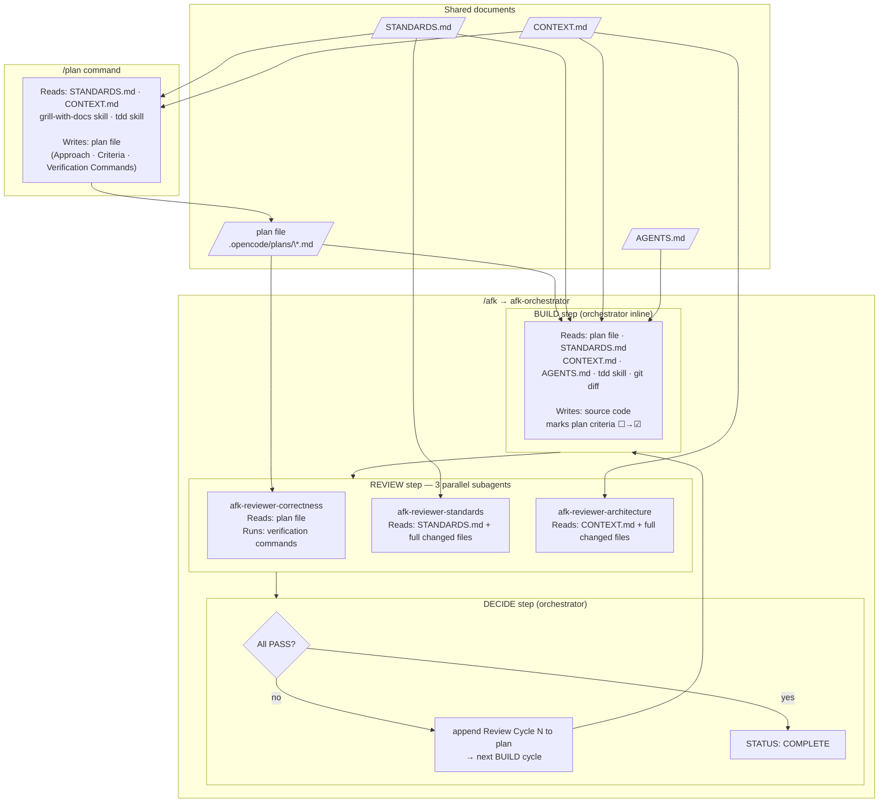

# AFK Loop — Information Flow

This document maps what each phase of the `/plan` → `/afk` workflow reads and writes, so gaps in context propagation are visible at a glance.

## Diagram

## Inputs and outputs per phase

| Phase | Reads | Writes |
|---|---|---|
| `/plan` | `STANDARDS.md`, `CONTEXT.md`, grill-with-docs skill, tdd skill | plan file (Approach, Acceptance Criteria, Verification Commands) |
| `afk-orchestrator` BUILD | plan file, `STANDARDS.md`, `CONTEXT.md`, `AGENTS.md`, tdd skill, `git diff` | source code; plan file (marks `[ ]` → `[x]` per criterion) |
| `afk-reviewer-correctness` | plan file (Acceptance Criteria + Verification Commands) | `VERDICT: PASS\|FAIL` |
| `afk-reviewer-standards` | `STANDARDS.md` (project root or `~/.config/opencode/` fallback); full content of every changed file | `VERDICT: PASS\|FAIL` |
| `afk-reviewer-architecture` | `CONTEXT.md`; `git diff`; full content of every changed file | `VERDICT: PASS\|FAIL` |
| `afk-orchestrator` DECIDE | 3 reviewer verdicts | `Review Cycle N` appended to plan file (on FAIL), or `STATUS: COMPLETE` (on all PASS) |

## Key invariants

- `STANDARDS.md` is the single source of truth for coding standards. It is read by both the builder (BUILD step) and the standards reviewer — they must use the same document to avoid the builder producing code that the reviewer flags for rules it never saw.
- The plan file is the shared state between all phases. The planner writes it, the builder reads and updates it, the correctness reviewer reads it, and the orchestrator appends to it after each review cycle.
- Reviewers are read-only — they never edit files or commit anything.
- `CONTEXT.md` is the domain glossary. Both the builder and the architecture reviewer use it; using off-glossary terms in code is an architecture violation.
